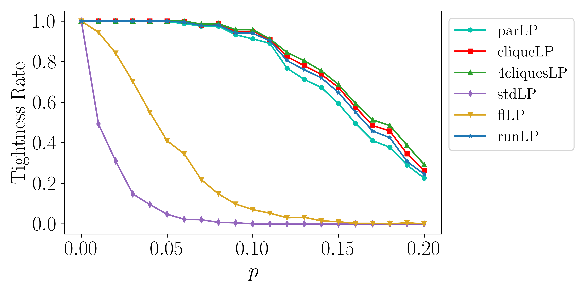
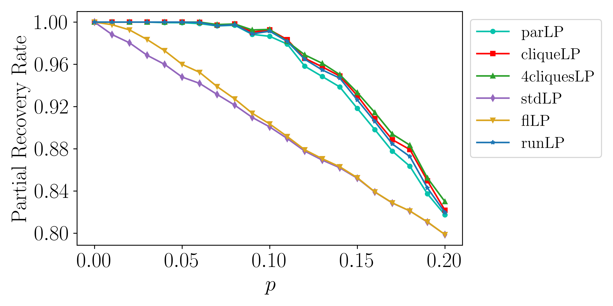
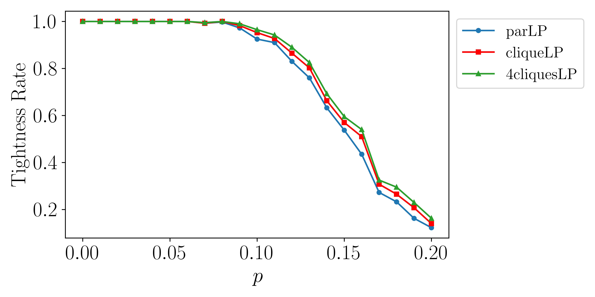
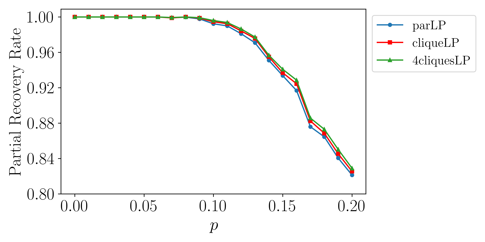
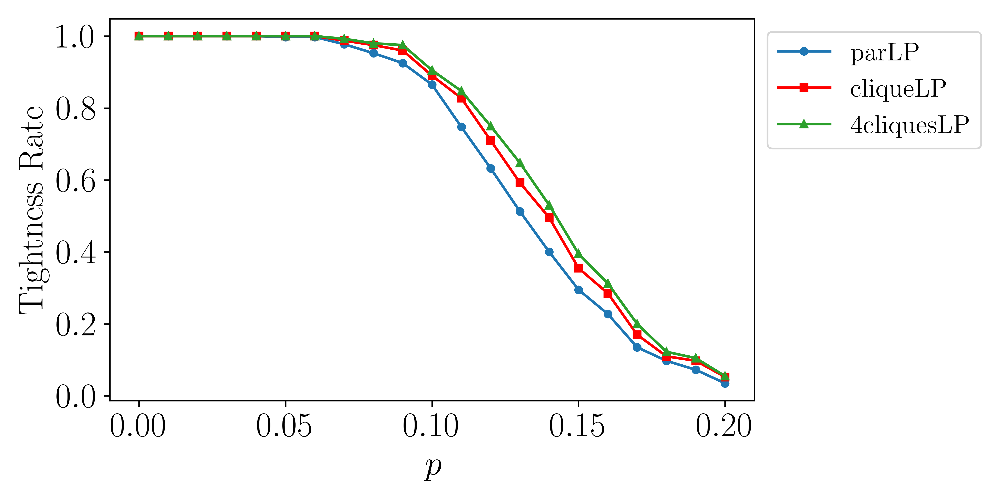
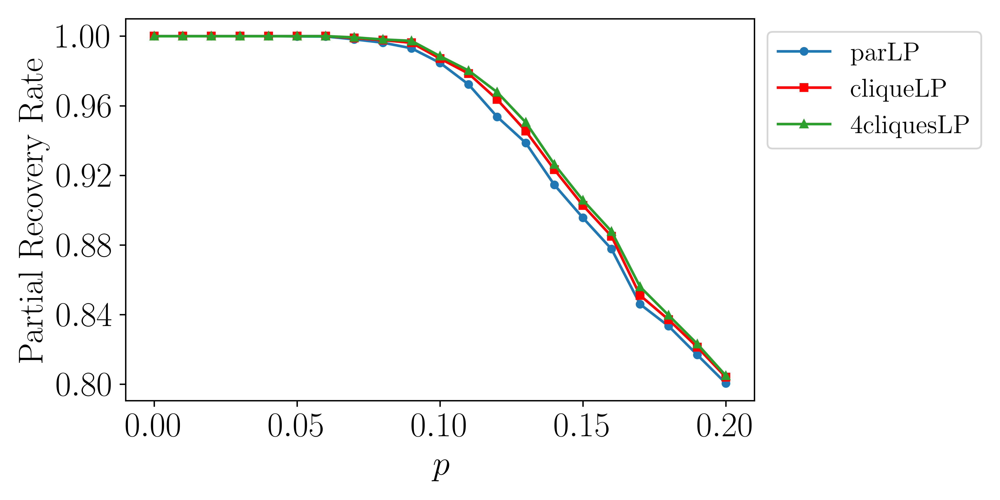
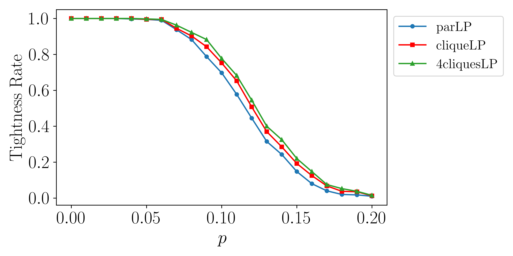
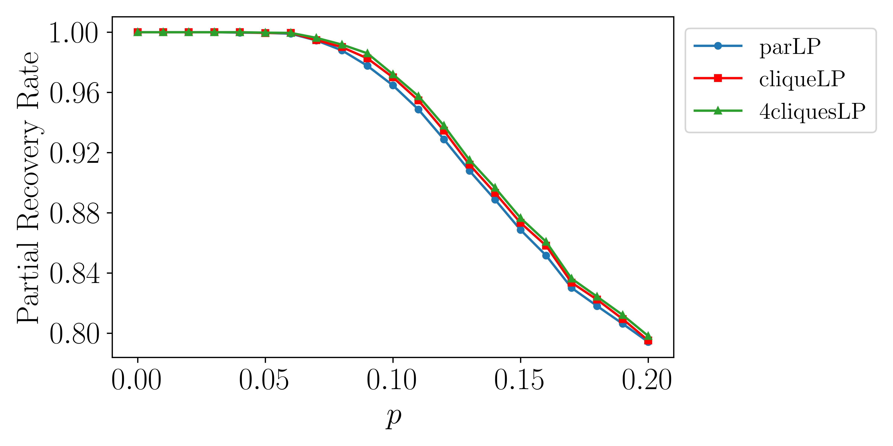

# LDPC Decoder Project

## Overview
This project implements an LDPC (Low-Density Parity-Check) decoder using C++. It includes functionality for generating LDPC codes, decoding with different LP relaxations.

- **src/**: Source codes.
- **length_120/**: Parity check matrix of code length 120 used in paper.
- **length_60/**: Parity check matrix of code length 60 used in paper.

## Dependencies
- C++ compiler supporting C++14 or higher.
- [Gurobi Optimizer](https://www.gurobi.com).

## Build the project:
Change the directory to 'src':
```bash
cd src
```
In `CMakeLists.txt`, update `GUROBI_HOME`:
```cmake
set(GUROBI_HOME "/path/to/your/gurobi/installation")
```
Then, run the following command to build the project:
```bash
mkdir build && cd build
cmake ..
make
```

## Execution:
Make a directory to store results:
```bash
mkdir output 
```

Execute with required parameters:
```bash
./LDPC_Decoder <clique_size> <density> <code_length> <num_trials>
```

Example:
```bash
./LDPC_Decoder 4 4 30 400
```

Parameters:
- clique_size: Size of cliques in LDPC graph
- density: Density parameter for LDPC code
- code_length: Length of the code
- num_trials: Number of trials to run

Output files will be generated in the `output/` directory.

## Results

The results reported in the paper were using parity check matrix in folder **length_120/** and **length_60/**. We assume an all-zero code as the ground truth code. For each type of code, we use the bit-flipping noise with p in 0 to 0.2, increase by 0.01 and for each p we generate 400 random trials. We then compare the performance of different LPs with respect to tightness rate and partial recovery rate. The tightness rate is the percentage of trials that LP returns binary solution and partial recovery rate is the fraction of bits that are identical in ground truth and decoding results.

<p float="left">
  
  
</p>
<p style="text-align: center"><em>(60,4,3) LDPC</em></p>

<p float="left">
  
  
</p>
<p style="text-align: center"><em>(120,4,3) LDPC</em></p>

<p float="left">
  
  
</p>
<p style="text-align: center"><em>(120,5,4) LDPC</em></p>

<p float="left">
  
  
</p>
<p style="text-align: center"><em>(120,6,5) LDPC</em></p>
